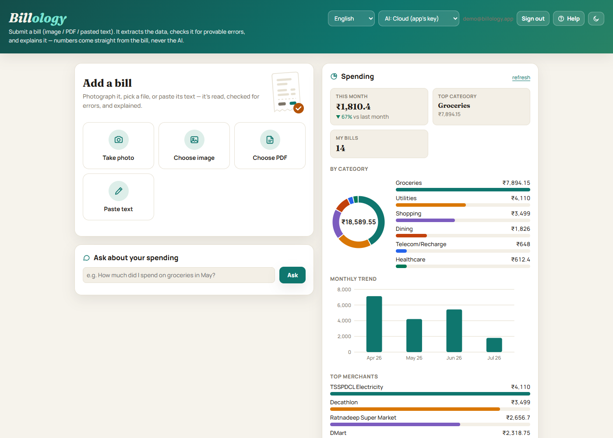
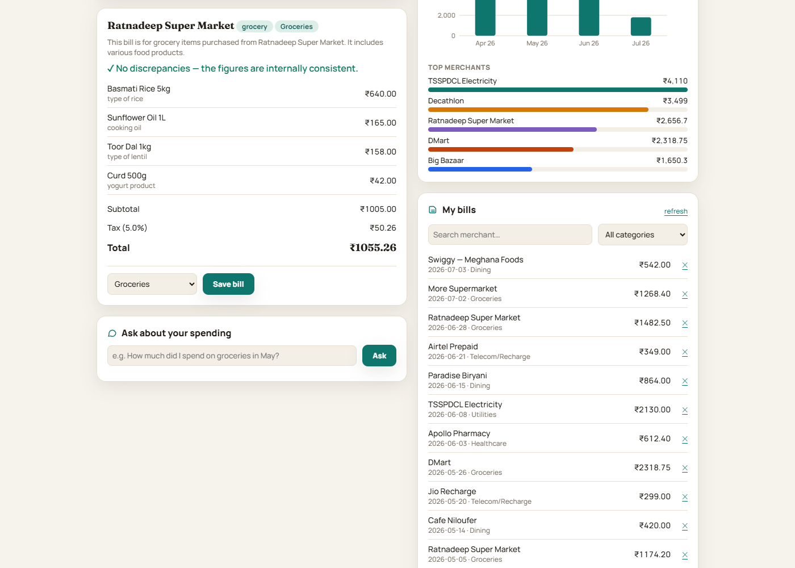
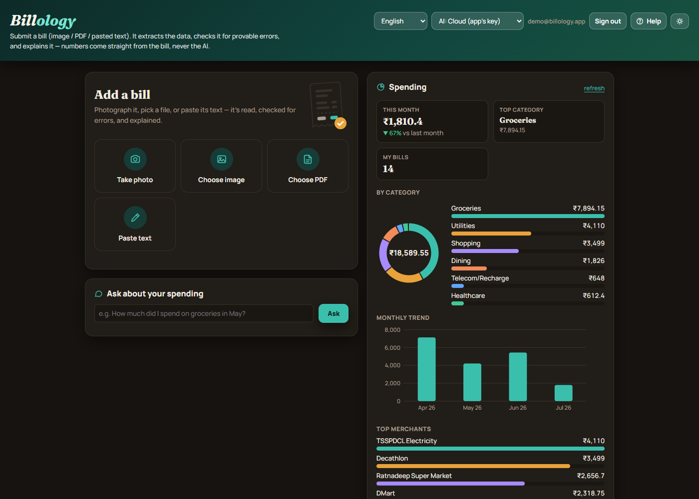
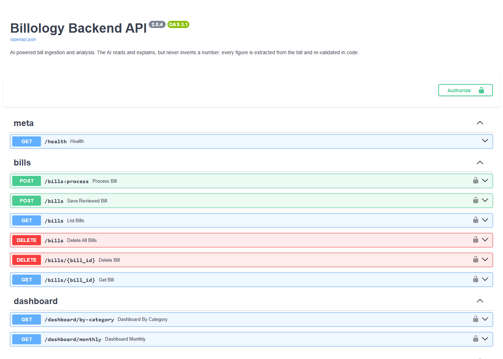

<div align="center">
  

  <h1>Billology</h1>

  <p><strong>AI-powered bill ingestion and analysis — where the AI reads and explains,<br/>but never invents a number.</strong></p>

  <p>
    <a href="https://github.com/srik-does/billology/actions/workflows/ci.yml"></a>
    <a href="LICENSE"></a>
    
    
    
    <a href="https://billology.onrender.com"></a>
  </p>
</div>

Submit a bill (photo, PDF, or pasted text). Billology extracts it, checks the
arithmetic for provable errors, explains every charge in plain language, categorizes it, saves it,
and answers natural-language questions about your spending.

**Live demo:** <https://billology.onrender.com> · API docs: <https://billology.onrender.com/docs>

## The core principle (the project constitution, v2)

> **Numbers come from the bill, never from the model's imagination.**

- Bill photos and scanned PDFs are read by a **vision LLM acting as a transcriber** (v2): it may
  only copy what is printed — computing, estimating, or filling in values is forbidden by prompt
  and constitution. Every transcribed figure is **re-validated in backend code** (strict parsing
  to exact `Decimal`; values that fail validation are dropped, never repaired) and carries a
  provenance flag plus a trace to the transcribed source line. The deterministic v1 pipeline
  (RapidOCR/Tesseract + parsers) remains the automatic fallback, and PDF text layers / pasted
  text stay purely deterministic.
- All arithmetic and discrepancy detection run in backend code over `Decimal`s.
- Everywhere else the LLM is a *language tool only*: it explains already-extracted values (from
  amount-free payloads), suggests categories, and translates questions into constrained,
  allowlisted query intents.

## Features

- **Capture** — image (vision-LLM extraction with deterministic OCR fallback), PDF (native text
  layer; fully scanned PDFs go through vision extraction), or pasted text.
- **Verify** — sum mismatches, duplicate charges, and tax errors flagged with the conflicting
  figures as evidence; legitimate non-summing layouts (discounts, tax-inclusive prices) are
  deliberately not flagged. Unreadable input gets an honest "couldn't read" — never fabrication.
- **Explain** — plain-language summary and per-line explanations beside (not instead of) the figures.
- **Review & save** — correct any field before saving; edits are marked `user_provided`.
- **History** — list, search by merchant, filter by category, delete one or clear all.
- **Spending dashboard** — by-category and monthly aggregates straight from SQL.
- **Ask** — dual-path Q&A: numeric (LLM derives a validated intent → code computes from real rows)
  and semantic (local embeddings → pgvector retrieval → grounded summary). Unanswerable questions
  return an explicit "not available", never an estimate.

## Screenshots

| Spending dashboard | Bill analysis (extract → verify → explain) |
|---|---|
|  |  |

| Dark theme | Interactive API docs |
|---|---|
|  |  |

*Screenshots show the bundled web client with demo data; the Android app shares the same backend and design language.*

## Architecture

```
React Native / Expo app ──┐
                          ├──► FastAPI backend (single trust boundary)
Web app (served at /) ────┘         │
                                    ├── extraction: vision LLM (transcribe-only) → code validation;
                                    │   fallback RapidOCR/Tesseract; pdfplumber / text parsers
                                    ├── parsers + arithmetic + discrepancy checks (Decimal, in code)
                                    ├── llm_service (Groq, provider-swappable): vision transcription /
                                    │   explain / categorize / query intents — never computed figures
                                    ├── fastembed (BAAI/bge-small-en-v1.5, 384-dim)
                                    └── Supabase: Postgres + pgvector + private Storage
```

> **Privacy note (v2)**: bill images are sent to the configured LLM provider (Groq by default)
> for vision extraction — a deliberate, documented trade-off for extraction accuracy
> (constitution v2.0.0, Principle IV). Set `VISION_EXTRACTION=false` for local-only OCR, or use
> the Ollama provider with a local vision model.

The mobile/web clients never call Groq or the database directly.

## Repository layout

| Path | Contents |
|---|---|
| `backend/` | FastAPI service, extraction/parsing/LLM services, migrations, tests |
| `mobile/` | Expo (React Native) app |
| `specs/` | Spec-Kit feature specifications (spec, plan, contracts, data model, tasks) |
| `.specify/` | Spec-Kit configuration, templates, and the project constitution |
| `render.yaml` | Render deployment blueprint |

## Running locally

### Backend

```powershell
cd backend
python -m venv venv ; .\venv\Scripts\Activate.ps1   # Windows
pip install -r requirements.txt
copy .env.example .env                               # fill in real values
uvicorn src.main:app --host 0.0.0.0 --port 8000
```

System dependencies (fallback OCR path): [Tesseract OCR](https://github.com/tesseract-ocr/tesseract)
and [Poppler](https://poppler.freedesktop.org/) on PATH. Apply `backend/src/db/migrations/*.sql` in
the Supabase SQL editor (in order) before first use.

Environment variables (see `backend/.env.example`): `SUPABASE_URL`, `SUPABASE_SERVICE_KEY`,
`SUPABASE_BUCKET`, `GROQ_API_KEY`, `GROQ_MODEL`, and optionally `GROQ_VISION_MODEL` (default
`meta-llama/llama-4-scout-17b-16e-instruct`) and `VISION_EXTRACTION` (default `true`). The
core extract→verify→explain flow degrades gracefully without keys (deterministic fallbacks).

### Mobile

```powershell
cd mobile
npm install --legacy-peer-deps
copy .env.example .env    # set EXPO_PUBLIC_API_BASE (deployed URL or your LAN IP)
npx expo start -c
```

Scan the QR with Expo Go (SDK 54).

## 📱 Install the Android app (APK)

A prebuilt Android APK is attached to every tagged [**GitLab Release**](https://code.swecha.org/srikeerthan_reddy/billology/-/releases)
as a downloadable asset (also mirrored in the project
[Package Registry](https://code.swecha.org/srikeerthan_reddy/billology/-/packages)).

1. Open the latest release, download **`billology.apk`** from the **Assets** section.
2. On your Android phone, open the downloaded file and tap **Install**. If prompted,
   enable **"Install unknown apps"** for your browser or file manager
   (Settings → Apps → Special access → Install unknown apps).
3. Launch **Billology**, grant the camera/photo permission, and submit a bill
   (photo, PDF, or pasted text).

The app is preconfigured to talk to the hosted backend at
<https://billology.onrender.com> (free tier — the first request after idle may take
~30 s to wake). Requires **Android 6.0+**; it's an unsigned preview build meant for
external/side-load distribution.

**Build the APK yourself** (Expo Application Services):

```powershell
cd mobile
npm install --legacy-peer-deps
npm install -g eas-cli
eas login
eas build --platform android --profile preview   # buildType: apk (see eas.json)
```

Releases are produced automatically: pushing a version tag (e.g. `v2.0.1`) runs the
`build-apk` + `release-apk` CI jobs, which build the APK, publish it to the Package
Registry, and create the GitLab Release with the APK linked as an asset. This
requires a masked `EXPO_TOKEN` CI/CD variable (Settings → CI/CD → Variables).

### Tests

```powershell
cd backend
pytest tests/ --cov=src
```

## Quality tooling

- **Lint:** ruff (`pyproject.toml`), eslint (`mobile/.eslintrc.json`)
- **Types:** mypy (`pyproject.toml`)
- **Secrets:** gitleaks (pre-commit + CI)
- **Dependency audit:** pip-audit / npm audit (CI)
- **Coverage:** pytest-cov (CI reports)
- **Changelog:** git-cliff (`cliff.toml`)
- **Hooks:** `.pre-commit-config.yaml` (`pre-commit install`)
- **CI:** GitHub Actions (`.github/workflows/ci.yml`) and GitLab CI (`.gitlab-ci.yml`) —
  lint and the backend test suite gate every push; type checks and security scans run advisory.

## Project documentation

Strategy and process docs live under [`docs/`](docs/):

- [Growth & continuous-improvement strategy](docs/growth-strategy.md) — how we grow
  the user base and keep improving features from real usage.
- [Reach expansion & user onboarding](docs/geographical-expansion.md) — horizontal,
  geographic/language expansion and the per-region onboarding playbook.
- [Contributor growth & community](docs/contributor-growth.md) — contributor
  on-ramps, onboarding, and expansion across institutions and regions.

See also [CONTRIBUTING.md](CONTRIBUTING.md), [CHANGELOG.md](CHANGELOG.md),
[SECURITY.md](SECURITY.md), and [COMPLIANCE.md](COMPLIANCE.md).

## License

[AGPL-3.0](LICENSE) — © 2026 Billology contributors.
